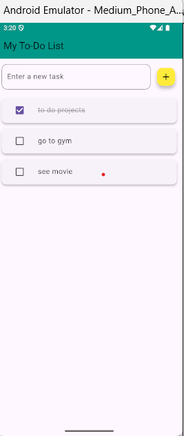

# Flutter To-Do App

A simple to-do app made with Flutter.

# Flutter To-Do App ✅

A minimal to-do list app built using Flutter. Allows you to add, delete, and check off tasks with local data persistence.

## 📸 Screenshots

| Home Page               |
|-------------------------|
|  |

## 🔥 Features

- Add new tasks
- Delete tasks with swipe
- Check/uncheck tasks
- Tasks saved locally using `shared_preferences`

## 🚀 Getting Started

```bash
git clone https://github.com/harshii-02/flutter_todo_app.git
cd flutter_todo_app
flutter pub get
flutter run
🛠️ Tech Stack
Flutter

Dart

shared_preferences
